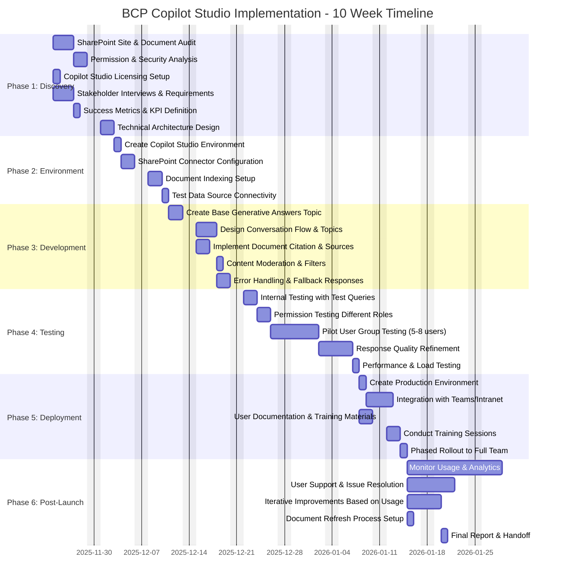
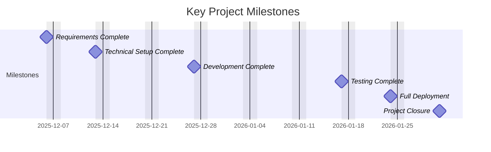

# Business Continuity Plan - Copilot Studio Implementation
## Project Gantt Chart



## Milestones



## Critical Path

The critical path (longest sequence of dependent tasks) is:

**Phase 1** → **Phase 2** → **Phase 3** → **Phase 4** → **Phase 5** → **Phase 6**

Specifically:
1. SharePoint Audit (1.1)
2. Permission Analysis (1.2)
3. Architecture Design (1.6)
4. Create Environment (2.1)
5. SharePoint Connector (2.2)
6. Document Indexing (2.3)
7. Test Connectivity (2.4)
8. Base Gen AI Topic (3.1)
9. Conversation Flows (3.2)
10. Error Handling (3.5)
11. Internal Testing (4.1)
12. Permission Testing (4.2)
13. Pilot Testing (4.3)
14. Quality Refinement (4.4)
15. Performance Testing (4.5)
16. Production Environment (5.1)
17. Teams Integration (5.2)
18. Phased Rollout (5.5)
19. Monitor & Support (6.1)

## Timeline Summary

| Phase | Duration | Start Date | End Date |
|-------|----------|------------|----------|
| Phase 1: Discovery & Planning | 2 weeks | Nov 24, 2025 | Dec 6, 2025 |
| Phase 2: Environment Setup | 1 week | Dec 9, 2025 | Dec 13, 2025 |
| Phase 3: Development | 1.8 weeks | Dec 16, 2025 | Dec 27, 2025 |
| Phase 4: Testing & Refinement | 2.6 weeks | Dec 30, 2025 | Jan 17, 2026 |
| Phase 5: Deployment | 1.5 weeks | Jan 20, 2026 | Jan 24, 2026 |
| Phase 6: Post-Launch Support | 2 weeks | Jan 27, 2026 | Jan 31, 2026 |

**Total Project Duration:** 10 weeks (Nov 24, 2025 - Jan 31, 2026)

## How to View This Chart

### Option 1: GitHub
- Push this file to GitHub - the Gantt chart will render automatically

### Option 2: VS Code
1. Install extension: "Markdown Preview Mermaid Support"
2. Open this file
3. Press `Ctrl+Shift+V` (or `Cmd+Shift+V` on Mac) to preview

### Option 3: Online Mermaid Editor
- Copy the mermaid code block
- Paste into: https://mermaid.live/

### Option 4: Export to Image
Use mermaid-cli:
```bash
npm install -g @mermaid-js/mermaid-cli
mmdc -i GanttChart.md -o gantt.png
```

## Notes

- **Weekends excluded** from timeline calculations
- **Parallel tasks** available in Phase 1 (1.3, 1.4 can overlap with 1.1, 1.2)
- **Buffer time** should be added for:
  - SharePoint permission complexity (+2-3 days)
  - Licensing procurement delays (potential +1-2 weeks)
  - Major pilot feedback changes (+3-5 days)
